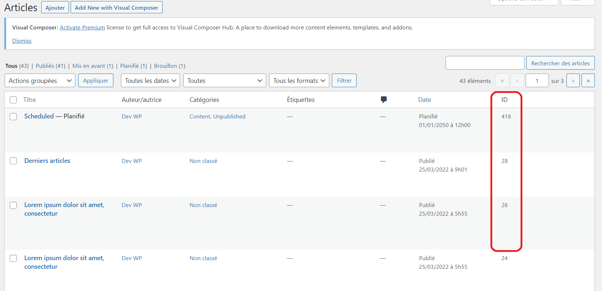

# Add-ID-Column

Gagner du temps ! Installer puis Activer cette extension et vous récupérerez facilement l'ID d'un article ou d'une page que vous voulez !

Vous pouvez avoir besoin de l'ID d'un article ou d'une page dans plusieurs cas, par exemple pour créer un shortcode personnalisé qui nécessite un ID comme paramètre. Ou lorsque vous ajoutez des widgets à un thème WordPress, vous pouvez également avoir besoin d'identifier l'ID de l'article. Eh bien, cette extension vous permet de gagner du temps pour récupérer très facilement l'ID de n'importe quels articles ou pages.

# Installation 
À PARTIR DE WORDPRESS

1. Allez dans 'Extensions > Ajouter'.
2. Recherchez 'Ajouter une colonne d'ID'.
3. Activez 'Ajouter une colonne d'ID' pour WordPress à partir du menu 'Extensions' de WordPress.
4. Allez dans Articles ou Pages, et récupérez l'ID d'un Article ou Page que vous voulez très facilement.

MANUELLEMENT

1. Téléchargez le dossier benawp-add-id-column/ dans le répertoire /wp-content/plugins/.
2. Activez le plugin dans le menu "Extensions" de WordPress.
3. Allez dans Articles ou Pages, et récupérez l'ID d'un Article ou Page que vous voulez très facilement.

# Utilisation

Puis allez dans le Back Office. Cliquez sur Articles ou Pages, et vous verrez un nouveau colonne nommé ID au niveau de votre listes d'Articles ou Pages, comme illustré les screenshots.

# Articles

# Pages

